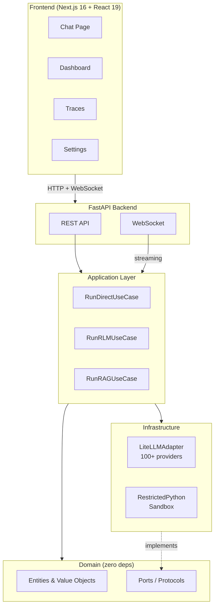

<h1>
  
  RLMKit
</h1>

**Recursive Language Model toolkit** — a Python library that lets LLMs write code to explore content that exceeds their context window.

[]()
[]()
[](https://github.com/gosha70/rlmkit/actions/workflows/ci.yml)

## What is RLMKit?

LLMs have fixed context windows. When your document is too large to fit in a single prompt, you lose information. RLMKit solves this by giving the LLM a Python sandbox where it can write code to navigate and analyze content dynamically — exploring only what's relevant.

RLMKit provides:

- **Three execution modes** — Direct (full context), RLM (recursive code generation), and Compare (side-by-side benchmarking)
- **Auto mode** — selects Direct or RLM based on content size (< 8K tokens → Direct, ≥ 8K → RLM)
- **100+ LLM providers** — via LiteLLM (OpenAI, Anthropic, Ollama, LM Studio, and more)
- **Budget controls** — cap tokens, cost, steps, and time
- **Sandboxed execution** — RestrictedPython prevents file/network/system access
- **[RLM Studio](#rlm-studio)** — a web app for experimenting, tuning, and comparing execution modes

## Where RLMKit Shines

RLMKit solves a specific class of problem. Knowing when it helps (and when it doesn't) saves you from over-engineering.

### Good fit

**Large documents that blow past context windows.** When inputs regularly exceed `50K`–`100K` tokens, full-context prompting gets expensive and answer quality degrades. RLM mode lets the model explore selectively, - reading only the sections it needs at a fraction of the token cost.

**Production workloads that need cost and time guardrails.** RLMKit caps tokens, cost, steps, and wall-clock time per execution. The outcome classifier flags failures and degraded results automatically. If you're running LLM workloads in production, budget enforcement is built in.

**Tasks where targeted exploration beats brute-force context.** Compliance reviews, contract analysis, multi-section report synthesis, and codebase Q&A all benefit from an LLM that can navigate to relevant sections instead of processing everything at once. RLM's `peek()`, `grep()`, and `chunk()` sandbox gives the model surgical access.

**Provider and mode benchmarking.** The **LLM Tuner** panel runs the same query across N providers × M modes in parallel, ranking results by cost, speed, or token efficiency. Ideal for choosing between providers or tuning RLM vs Direct tradeoffs.


### Not a fit

**Documents that fit comfortably in context.** If your inputs stay under `8K` tokens, Direct mode works, but a standard LLM client is likely sufficient for your needs.

**Workloads that don't benefit from code generation in the loop.** RLM's core mechanism is an LLM writing `Python` to explore content. For straightforward Q&A, short-text summarization, or classification, the recursive loop adds latency without adding value.

**Pure retrieval over a static corpus.** If your primary need is _"search N documents, return relevant chunks"_,  a dedicated RAG pipeline (vector store + reranker) is simpler and faster. RLMKit includes a RAG mode, but it's not a replacement for purpose-built retrieval infrastructure at scale.

## Quick Start

### Installation

```bash
# Using uv (recommended)
uv sync --extra all

# Using pip
pip install -e ".[all]"
```

### Usage

```python
from rlmkit import interact

result = interact(
    content="Your document text here...",
    query="What is this about?",
    provider="openai",
    model="gpt-4o"
)

print(result.answer)
print(f"Tokens: {result.total_tokens:,}")
print(f"Cost: ${result.total_cost:.4f}")
print(f"Mode used: {result.mode_used}")
```

### Execution Modes

```python
# Direct — send full content in one LLM call (small documents)
result = interact(content, query, mode="direct")

# RLM — LLM writes Python to explore content recursively (large documents)
result = interact(content, query, mode="rlm")

# Auto — let RLMKit choose based on content size (default)
result = interact(content, query, mode="auto")

# Compare — run both RLM and Direct, return metrics for each
result = interact(content, query, mode="compare")
```

| Mode | Best For | How It Works |
|------|----------|--------------|
| `direct` | < 8K tokens | Full context in single LLM call |
| `rlm` | Any size | LLM writes code to navigate content via `peek()`, `grep()`, `chunk()` |
| `auto` | Any size | Selects `direct` (< 8K tokens) or `rlm` (≥ 8K tokens) automatically |
| `compare` | Benchmarking | Runs RLM and Direct concurrently, returns metrics for both side by side |

### Configuration

```python
result = interact(
    content=large_document,
    query="Summarize the key findings",
    mode="auto",
    provider="anthropic",
    model="claude-sonnet-4-6",
    max_steps=16,          # RLM loop budget
    temperature=0.7,
    verbose=True           # Print progress
)
```

### Supported Providers

Set the API key as an environment variable, then pass the provider name:

| Provider | Env Variable | Example Model |
|----------|-------------|---------------|
| OpenAI | `OPENAI_API_KEY` | `gpt-4o` |
| Anthropic | `ANTHROPIC_API_KEY` | `claude-sonnet-4-6` |
| Ollama | (local, no key) | `llama3.2` (must specify `model=`) |
| LM Studio | (local, no key) | Any served model (must specify `model=`) |
| Google | `GOOGLE_API_KEY` | `gemini-pro` |
| 100+ more | via LiteLLM | See [LiteLLM docs](https://docs.litellm.ai/) |

## RLM Studio

RLM Studio is a web application for experimenting with RLMKit interactively. Use it to demo RLM capabilities, tune runtime parameters, compare execution modes side by side, and monitor cost/performance metrics.

### Starting RLM Studio

```bash
# Terminal 1: Backend API server (default port 8000)
uv run python -m rlmkit.server --reload

# Custom port — set RLMKIT_PORT and point the frontend at the same address
RLMKIT_PORT=8080 uv run python -m rlmkit.server --reload
NEXT_PUBLIC_API_URL=http://localhost:8080 npm run dev  # Terminal 2

# Terminal 2: Frontend (default, connects to port 8000)
cd frontend && npm run dev
```

Open [http://localhost:3000](http://localhost:3000) in your browser.

### What You Can Do

- **Chat** — Upload documents and query them using one or more Chat Providers in parallel. Responses appear in a side-by-side column layout with per-response metrics (tokens, cost, latency).
- **Dashboard** — View aggregated metrics per session: total tokens, cost, average latency, token savings. Charts break down performance by provider and execution mode.
- **Traces** — Inspect every execution step-by-step. See the code the LLM generated, the output it received, token counts, and timing for each step. Visualize as timeline, tree, or raw code.
- **Settings** — Configure providers, create Chat Providers, set budgets, manage profiles, customize system prompts, and switch themes.

For a complete walkthrough of all RLM Studio features, see **[docs/rlm-studio-guide.md](docs/rlm-studio-guide.md)**.

## Architecture



**Dependency rule:** inner layers never import from outer layers. All external dependencies sit behind port interfaces.

```
src/rlmkit/
├── domain/            # Entities, ports (zero external deps)
├── application/       # Use cases (run_rlm, run_direct, run_rag)
├── infrastructure/    # Adapters (LiteLLM, sandbox, storage)
├── server/            # FastAPI REST + WebSocket server
└── api.py             # Public interact() / complete() API

frontend/              # Next.js 16 + React 19 + shadcn/ui
├── src/app/           # Pages: chat, dashboard, traces, settings
├── src/components/    # 50+ React components (shadcn/ui + custom)
└── src/lib/           # API client, WebSocket hook, types
```

## Running Tests

```bash
# All tests
uv run pytest tests/ -v

# With coverage
uv run pytest tests/ --cov=rlmkit --cov-report=term-missing

# Frontend type check
cd frontend && npx tsc --noEmit
```

## License

Copyright (c) 2026 EGOGE. MIT License — see [LICENSE](LICENSE).
